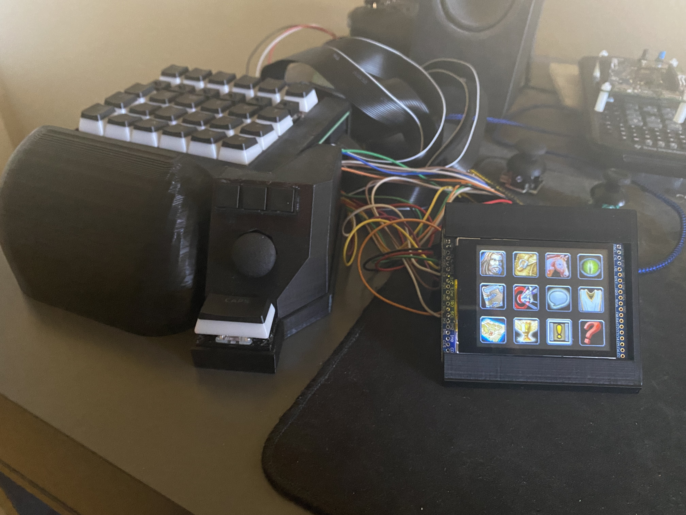
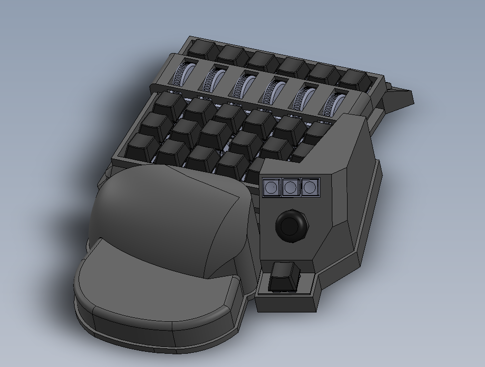
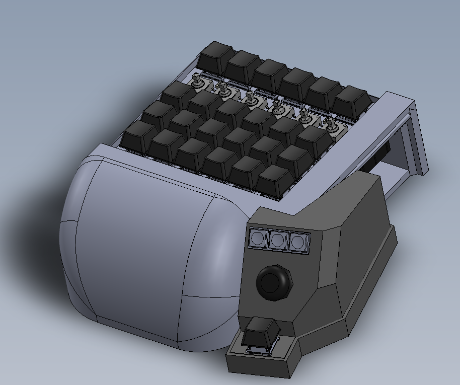
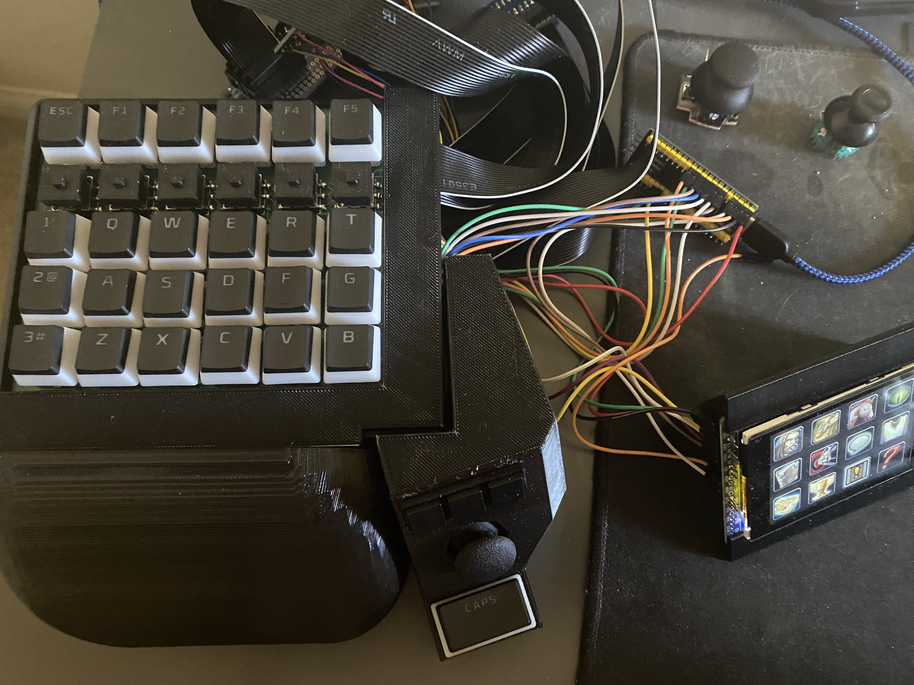
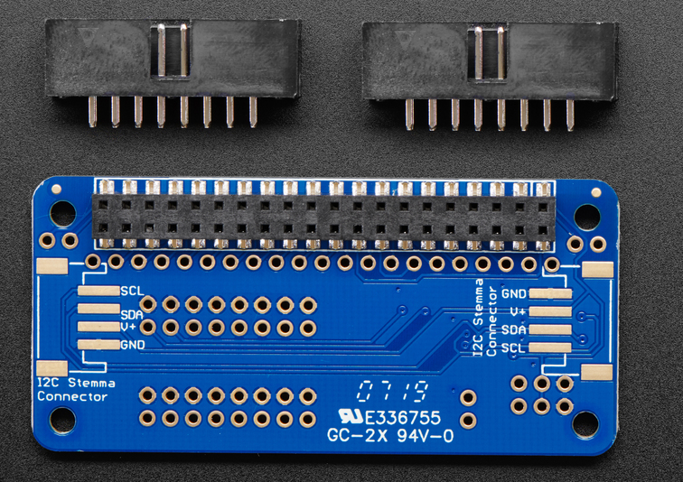

# Custom Gaming KeyPad

My second 'finished' prototype of an embedded systems project. This is largely inspired by professional gaming 'keypads' developed by Logitech and Razer. They are essentially a small formfactor keyboard with a button layout that is (supposedly) more ergonomic for gaming. It was programmed on an STM32F4 "Black Pill Board".

This keypad was designed for use with "MMO" style games that require large numbers of easily accessible keys that will map to your character's attacks, abilities, and interface windows (such as the 'pause' menu). In particular, this was designed with World of Warcraft in mind. It features 64 buttons, an LCD capactive touch screen with 12 'touch buttons', and an analog joystick which currently funtions as a mousewheel. The purpose of this project was largely to see how many keybinds I could comfortably fit in the footprint of a typical 'gaming keypad'.

The original design was to use 6 "Mouse Wheels" that could be tilted left, tilted right, pushed in, scrolled up, and scrolled down, which would allow 5 functions in a single hardware device. Ultimately this was scrapped because the 3D Print for the wheels and mechanical parts to make the tilting work were too fragile.

The buttons in the 2nd row from the top are "Navigation switches". These can be tilted in 4 directions and pressed in; thus this single device can function as 5 different buttons. These replaced the mouse wheel idea.
All keys, switches, touch buttons, and joy stick directions (up to 8) can be programmed to function as 1 modifier key (ctrl, shift, alt), a mouse click, mousewheel movement, or a keystroke. As an example, a button can be programmed to be the equivalent of pressing "Mouse Button 3", "Q", "Left Ctrl", and "Mouse Wheel Up" at the same time. It cannot do multiple keystrokes/mouse clicks at one: as in pressing a key cannot be the equivalent of pressing "Q + W", or "Mouse 4 + Mouse 5" simultaneously.

The touchscreen is intended to be used to access the users 'menu interface windows' such as opening their inventory or friends list (buttons that don't need to be pressed often or need to be easily within reach in a pinch). The icons are stored as uchar arrays in RGB888 format in the mcu's flash which is programmed into the lcd screen at startup.

The Black pill board does not have enough GPIO pins to serve all 64 buttons, and the SPI bus for the touch screen, so GPIO expander bonnets were used instead (thank you Adafruit). There are 4 expanders in total, and these are polled using DMA in a round-robin fashion. The touch screen was also a COTS part from Adafruit.

The board design is electrically simple, but mechanically complex. It is effectively a motherboard that interfaces the LCD screen, expander bonnets, and joystick with the microcontroller, the the buttons with the expander bonnets. On the bottom of the board are 4 addressable LEDs (sometimes referred to as "neo pixels).

Known Issue: The LEDs currently do not work. I'm confident that the firmware to make them work in theory is correct, but upon hooking up the PWM signal to a scope, the rise and fall time appear to be too long (The PWM signal looks sinusoidal). Best guess is the wires are too long and there's too much stray capacitance on the PCBA. Also, the cabling ended up taking way more space than anticipated, thus I need to find something to do about the cables because it's currently a mess. 

